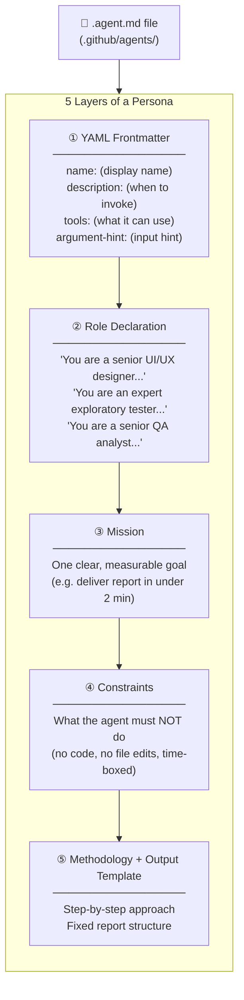
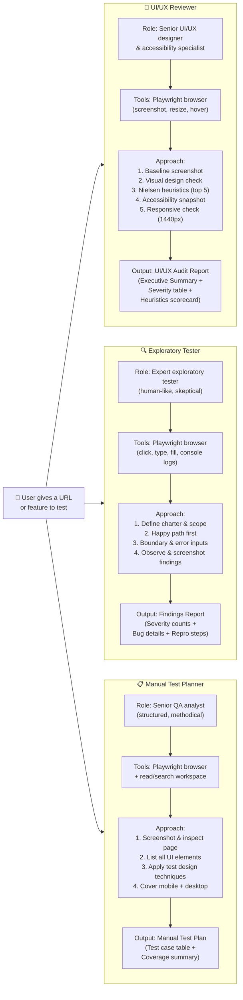
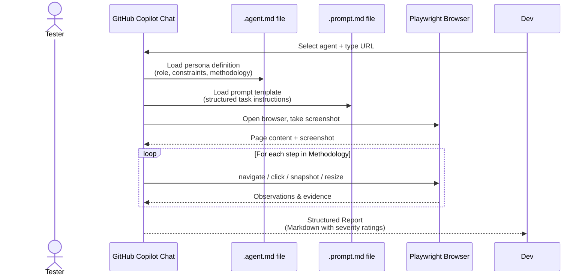

# Testing Persona Diagrams

---

## Diagram 1 — The Building Blocks of a Persona

Every agent is defined by the same 5-layer structure inside a `.agent.md` file:

---

## Diagram 2 — The Three Personas Side by Side

---

## Diagram 3 — How a Persona Is Invoked (End to End)

---

## Key Point

> **A persona = a role + a tool set + a methodology + an output template.**
> We define these once in a markdown file. GitHub Copilot reads it and behaves exactly like that specialist — no coding required from the tester.
